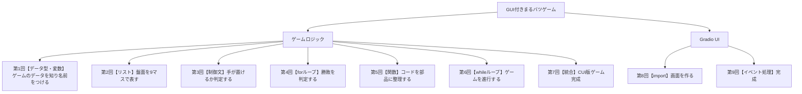

# Python入門オンデマンド講座の紹介

## 自己紹介と本講座で学べること

みなさんはじめまして。慶應義塾大学AI・高度プログラミングコンソーシアム（通称 AIC）の〇〇と申します。今回のオンデマンド講座では、プログラミング完全初心者を対象に、Pythonというプログラミング言語を使用し、最終的にみなさんの手元のパソコンで動くまるバツゲームを作成することを目標に学習を進めていきます。（ここで実際にまるばつゲームを触っている様子をスライドで見せる）巷に存在するプログラミング講座では、ボトムアップ的に教科書の1ページ目から進めていく流れでプログラミングを学んでいきますが、本講座では「まるバツゲーム」という最終成果物を作成することを最上位の目標に設定し、この目標をさらに10分から12分程度からなる各講義の中で達成しやすい小目標に分解し、各回ではこの小目標に基づいた部品（モジュール）を作成していく流れになっています。ですので、受講生のみなさんには全9回の講義を視聴し、手元でプログラムを書いていくと、第9回目には自然と完成したまるばつゲームが作成されるようになっています。

## なぜPythonを学ぶのか

なぜ数あるプログラミング言語の中からPythonを学ぶのかをお伝えし、講座の本編に行きたいと思います。はっきりお伝えすると、Pythonを学ぶとおそらくみなさんが実現したいほぼすべてのことを実現することができるからです。

1. 学びやすい言語：文章を読むかのようにわかりやすいコードを目標に作られたプロフラミング言語です。（可能ならC言語との比較）
2. コスパの良い言語：データ分析、業務自動化、アプリ開発、AI開発等、Pythonひとつで色々なことができます。
3. 人気の言語：TIOBE INDEXという世界的に有名なプログラミング言語の人気ランキングでは、Pythonは2022年から2025年まで、4年連続1位を獲得しています。つまり世界で最も人気のプログラミング言語として認められています。Youtbe, Instagram, NetflixなどのインターネットサービスでもPythonが活用されています。

## 本講座の目標

このような講座体系にすることで、受講生のみなさんには体験的にプログラミングを学習してもらい、最後まで完走してもらうことを目標にしています。

## 本講座の特徴

## 本講座のカリキュラム一覧

本講座の具体的な構成は、次のようになっています。最終成果物であるGraphical User Interfaceで動くまるバツゲームを作成するために、作成するプログラムを「ゲームロジック」と「Gradio UI」の2部品に分けました。これは、人間でいうところの内面と外面で分けることに相当します。良い人間であるためには、内面と外面の両方を磨くことが大事なようにまるバツゲームを作成するときも、ゲームの動作ルールを与える「ゲームロジック」と、ゲームの見栄えを飾る「User Interface」の2つに分けていきます。

## Pythonの実行環境とGoogle Colaboratoryの説明

また本講座では、Pythonの実行環境にGoogle Colaboratoryを採用しています。環境構築は、プログラミング初心者の最初の挫折ポイントです。Google Colaboratoryなら、URLをクリックするだけで即座にプログラミングを開始することができます。面倒な設定やインストール作業は一切必要ありません。

それでは、Python入門オンデマンド講座の本編に進み、Pythonを学んでいきましょう。みなさんが、この講座をきっかけにさらなる可能性・世界を見つけてもらえるよう、わかりやすくお伝えしていきます。

1. 完全初心者向け
2. 無料
3. 短時間
4. スキマ時間
5. 準備不要

## Motivateする締め