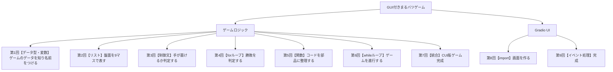

# Python入門オンデマンド講座 第0回：オリエンテーション

## 構成

| セクション | 内容 | 目安時間 |
|---|---|---|
| 自己紹介・講座紹介 | 講師紹介、講座のゴール | 1.5分 |
| なぜPythonを学ぶのか | Pythonの特徴と優位性 | 2分 |
| 本講座の設計思想 | ゴール駆動型・モジュール積み上げ方式 | 2分 |
| カリキュラム全体像 | 全9回の内容と木構造図 | 2分 |
| 実行環境の紹介 | Google Colaboratoryの説明 | 1.5分 |
| 締めのメッセージ | 学習意欲を高める締め | 1分 |

---

## スクリプト

### 自己紹介・講座紹介（約1.5分）

みなさんはじめまして。慶應義塾大学AI・高度プログラミングコンソーシアム（通称AIC）の〇〇と申します。本日から全9回にわたるPython入門オンデマンド講座を担当させていただきます。どうぞよろしくお願いします。

この講座では、プログラミングが完全に初めての方を対象に、Pythonというプログラミング言語を使って、最終的にみなさんの手元で実際に遊べる「まるバツゲーム」を作り上げることを目標に学習を進めていきます。

【スライドで動作するまるバツゲームを見せる】

「プログラミングって難しそう……」「自分には向いていないかも……」と思っている方も多いかもしれません。大丈夫です。この講座は、プログラミング経験がゼロの方でも確実に前に進めるよう丁寧に設計されています。一緒に進めていきましょう。

---

### なぜPythonを学ぶのか（約2分）

まず、なぜ数あるプログラミング言語の中からPythonを学ぶのか、その理由をお伝えします。

理由は3つあります。

1つ目は、**「学びやすい言語」**だからです。Pythonは、英語の文章を読むようにわかりやすいコードが書けることを目標に設計されています。

【他の言語との比較スライドを見せる】

たとえば、「こんにちは」と画面に表示するだけでも、言語によっては複雑な記述が必要になります。しかしPythonなら、たったの1行で書けます。初心者の方が文法の複雑さに頭を使わなくて済むため、本質的な「プログラムの考え方」に集中できます。

2つ目は、**「コスパが非常に良い言語」**だからです。Pythonひとつを身につけるだけで、データ分析・業務自動化・Webアプリ開発・そして近年話題のAI・機械学習まで、非常に幅広い分野をカバーできます。複数の言語を学ぶ手間なく、1つの言語で多くのことができるのは大きな強みです。

3つ目は、**「世界で最も人気の言語」**だからです。プログラミング言語の世界的な人気ランキングであるTIOBE INDEXでは、Pythonは2022年から4年連続で1位を獲得しています。YouTube・Instagram・Netflixといった世界中で使われるサービスの裏側でもPythonが活用されています。Pythonを学ぶということは、世界標準のスキルを身につけることに直結します。

---

### 本講座の設計思想（約2分）

次に、この講座の最大の特徴である「設計思想」をお伝えします。

一般的なプログラミング入門講座の多くは、教科書の1ページ目から順番に文法を学んでいく「ボトムアップ型」です。変数を学んで、条件分岐を学んで、ループを学んで……という積み上げ方式ですね。この方法は体系的ではあるのですが、学んでいる途中で「今なぜこれを学んでいるのか？」という目的を見失いやすい、という欠点があります。

本講座では、この問題を解決するために**「ゴール駆動型」**の設計を採用しています。まず最終成果物である「まるバツゲーム」を定め、そのゲームを動かすために必要な部品（モジュール）に分解し、各回でその部品を1つずつ作りながら、必要な文法・概念を学ぶ構成です。

【木構造図スライドを見せる】

毎回の冒頭では、この木構造図を提示します。この図によって、「今回学ぶ内容が最終成果物のどの部分に対応しているか」が一目でわかります。みなさんは常に「今日作る部品がゲームのここで使われるんだ」という実感を持ちながら学習を進めることができます。

また、作成した部品は回を追うごとに積み上がっていきます。最終回には、自分が積み上げた部品が組み合わさって、動くゲームが完成する。この体験こそが、この講座の最大の特徴です。

---

### カリキュラム全体像（約2分）

それでは、全9回のカリキュラムを確認しましょう。

【カリキュラム全体の木構造図を見せる】

第1回から第7回は「ゲームロジック」を作ります。ゲームのルールや動作をプログラムで実装する、いわばゲームの「中身」の部分です。変数・リスト・条件分岐・ループ・関数といったPythonの基本文法を、ゲームの部品を作りながら順番に身につけていきます。

第8回・第9回は「Gradio UI」を作ります。完成したロジックに見た目を与える、「外側」の部分です。Gradioというライブラリを使ってボタンや画面を作り、ロジックと接続することでGUI付きの完成版を仕上げます。

各回は10分から12分程度のマイクロラーニングです。通学中や休憩時間などの隙間時間でも視聴できる長さに設計されています。

---

### 実行環境の紹介（約1.5分）

本講座では、Pythonの実行環境に**Google Colaboratory（通称 Google Colab）**を採用しています。

プログラミング初心者が最初につまずく壁のひとつが「環境構築」です。Pythonをパソコンにインストールして、エディタを設定して……という作業は、初心者にとって非常にハードルが高く、ここで挫折してしまう方も少なくありません。

Google ColabはGoogleが提供するブラウザ上のサービスです。Googleアカウントさえあれば、URLをクリックするだけで即座にPythonプログラミングを始めることができます。インストール不要、難しい設定も一切ありません。

【Google Colabの画面スライドを見せる】

この講座専用のColabノートブックを各回に用意しています。リンクを開いて、コードを実行するだけで受講できます。初回から「動く体験」ができるよう設計されています。

---

### 締めのメッセージ（約1分）

最後に一言お伝えします。

この講座を最後まで受講し、手元に動くまるバツゲームが完成したとき、みなさんには必ず「自分でもプログラムが書けるんだ」という確かな自信が生まれているはずです。その自信こそが、その後のプログラミング学習を加速させる最大のエンジンになります。

各回は短く、着実に前に進める設計になっています。難しく考えず、まずは第1回から始めてみてください。

それでは、Python入門オンデマンド講座、始めていきましょう！
