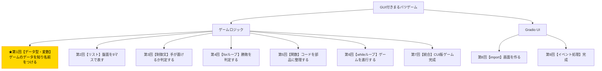

# Python入門オンデマンド講座 第1回：ゲームのデータを知り名前をつけよう【データ型・変数】

## 構成

| セクション | 内容 | 目安時間 |
|---|---|---|
| 導入 | 木構造で現在地確認・今回の目標提示 | 1分 |
| 講義前半 | データ型（str/int/bool）、type()、変数の代入・再代入、命名規則 | 6分 |
| 講義後半 | 演習：ゲームのデータを変数で管理する | 3分 |
| まとめ | 要点整理・現在地確認・次回予告 | 1分 |

---

## スクリプト

### 導入（1分）

【木構造図を見せる。B1ノードを強調表示する】



第1回へようこそ。全9回の最初の回です。まず、今自分たちがゲームのどの部分を作ろうとしているのかを確認しましょう。

この木構造図を見てください。最終ゴールである「GUI付きまるバツゲーム」を頂点に、ゲームを構成する部品が枝分かれしています。今回取り組むのは、金色で強調されている「ゲームのデータを知り名前をつける」という部分です。

今回の小目標は、**「ゲームで使うデータの種類を理解し、変数に格納して操作できるようにすること」**です。習得する概念は、データ型・`type()`・変数への代入と再代入・命名規則の4つです。それでは始めましょう。

---

### 講義前半（6分）

#### まず「データ」って何だろう？

プログラムは「データを処理する」ことが基本です。まるバツゲームで扱うデータには何があるか、ちょっと考えてみてください。

そうですね、たとえば「今どちらの手番か」「あるマスに何が置かれているか」「ゲームはまだ続いているのか」といった情報が必要ですよね。これらをプログラムで扱うために、まず**「データ型」**という概念を理解する必要があります。

#### 文字列（str）

最初のデータ型は**文字列（string）**です。文字列は、文字の並びを表すデータ型で、Pythonではダブルクォートまたはシングルクォートで囲んで書きます。

まるバツゲームでは、マスに置かれるマーク「`X`」と「`O`」、そして何も置かれていない空のマス「` `（半角スペース）」の3種類が文字列として登場します。

【コード実演：Colabで以下を入力・実行する】

```python
"X"
"O"
" "
```

#### 整数（int）

次のデータ型は**整数（integer）**です。まるバツゲームでは、盤面の9つのマスをどう区別するかが重要です。この講座では、左上から右下にかけて0番から8番の番号を振ることにします。

【盤面のマス番号図を見せる：0〜8の番号が入った3×3グリッド】

```
0 | 1 | 2
---------
3 | 4 | 5
---------
6 | 7 | 8
```

この「どこに置くか」を表す数字が整数です。

#### ブール値（bool）

3つ目のデータ型は**ブール値（boolean）**です。ブール値は`True`（真）か`False`（偽）の2値しか取らない特別なデータ型です。

まるバツゲームでは、「ゲームはまだ進行中か」「あるマスは空いているか」といった「はい/いいえ」で答えられる状態を表すときに使います。

#### type()で型を確認する

Pythonには、あるデータが何型かを調べる便利な関数`type()`があります。

【コード実演：Colabで以下を入力・実行する】

```python
print(type("X"))      # <class 'str'>
print(type(0))        # <class 'int'>
print(type(True))     # <class 'bool'>
```

それぞれ`str`・`int`・`bool`と表示されましたね。これが各データ型の名前です。

#### 変数への代入

データ型がわかったところで、次は**「変数」**の話をします。変数とは、データに名前をつけて記憶しておく仕組みです。

たとえば、「今の手番は`X`である」という情報を、毎回`"X"`と書くのではなく、`current_player`という名前で記憶しておけると便利ですよね。これが変数です。

Pythonでは`=`を使って変数にデータを代入します。

【コード実演：Colabで以下を入力・実行する】

```python
current_player = "X"
print(current_player)  # X
```

`current_player`という変数に`"X"`という文字列を代入し、`print()`で画面に表示しました。

#### 再代入で手番を切り替える

変数の強みは、**後から値を書き換えられる**ことです。これを「再代入」と呼びます。

ゲームでは`X`が1手打ったら次は`O`の手番になりますよね。これを再代入で表現できます。

【コード実演：Colabで以下を入力・実行する】

```python
current_player = "X"
print(current_player)  # X

current_player = "O"   # 再代入
print(current_player)  # O
```

最初は`X`、再代入後は`O`に変わりましたね。変数は「現在の値を保持する箱」だと考えてください。

#### 命名規則

最後に、変数の名前のつけ方（命名規則）についてひとつだけお伝えします。

Pythonでは、複数の単語からなる変数名を書くときに、単語と単語をアンダースコア（`_`）でつなぐ**スネークケース**という書き方が一般的です。`currentPlayer`（キャメルケース）ではなく、`current_player`と書くのがPython流です。

この講座では一貫してスネークケースを使います。覚えておいてください。

---

### 講義後半 ─ 演習（3分）

それでは、今学んだ内容を使って実際にコードを書いてみましょう。

【演習スライドを見せる。ヒント付きのスケルトンコードを提示する】

**課題：ゲームの初期状態を変数で表現してください。**

ヒントを見ながら、以下のことを順番にやってみてください。

1. 手番を表す変数`current_player`に初期値`"X"`を代入してください。
2. ゲームの継続状態を表す変数`game_active`に初期値`True`を代入してください。
3. 0番のマスの状態を表す変数`cell_0`に初期値`" "`（半角スペース）を代入してください。
4. すべての変数を`print()`で表示してください。
5. `current_player`を`"O"`に再代入して、もう一度`print()`で表示し、手番が切り替わったことを確認してください。

【解答例コードを見せる前に、受講生が自力で試せる時間を30秒程度置く】

【解答例を見せる】

```python
# 1. 手番
current_player = "X"

# 2. ゲームの継続状態
game_active = True

# 3. 0番マスの状態
cell_0 = " "

# 4. 表示
print(current_player)  # X
print(game_active)     # True
print(cell_0)          # （半角スペース）

# 5. 手番を切り替える（再代入）
current_player = "O"
print(current_player)  # O
```

できましたか？変数を使うことで、ゲームの状態をプログラムの中に「記憶」させることができました。

---

### まとめ（1分）

今回学んだことを振り返りましょう。

- Pythonには**文字列（str）・整数（int）・ブール値（bool）**といったデータ型がある
- `type()`を使うとデータの型を確認できる
- `変数名 = 値`の形でデータに名前をつけて記憶できる（代入）
- `=`で後から値を書き換えることができる（再代入）

今回は、ゲームの各状態を変数で管理できるようになりました。ただ、9つのマスを1つ1つ別々の変数（`cell_0`・`cell_1`・`cell_2`……）で管理するのは、非常に大変ですよね。

**次回は「リスト」という仕組みを使って、この9マスをスッキリ一括管理する方法を学びます。**

【木構造図を再表示し、次回のB2ノードを示す】

お疲れさまでした！
