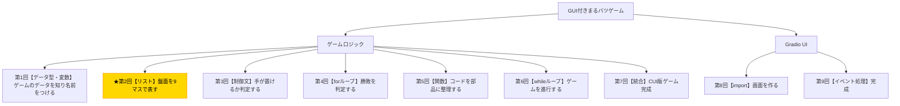

# Python入門オンデマンド講座 第2回：盤面を9マスのリストで作ろう【リスト】

## 構成

| セクション | 内容 | 目安時間 |
|---|---|---|
| 導入 | 木構造で現在地確認・今回の目標提示 | 1分 |
| 講義前半 | リスト作成・インデックス・要素変更・len()・in演算子 | 6分 |
| 講義後半 | 演習：盤面をリストで表現し3×3表示する | 3分 |
| まとめ | 要点整理・現在地確認・次回予告 | 1分 |

---

## スクリプト

### 導入（1分）

【木構造図を見せる。B2ノードを強調表示する】



第2回へようこそ。前回の終わりに、「9マスを9個の変数で管理するのは大変」という話をしましたね。今回はその問題を解決する**「リスト」**という仕組みを学びます。

今回の小目標は、**「盤面をリストで表現し、インデックスを使って操作・表示できるようにすること」**です。習得する概念は、リストの作成・インデックスによるアクセス・要素の変更・`len()`関数・`in`演算子の5つです。

---

### 講義前半（6分）

#### 前回の問題を振り返る

前回は、ゲームのデータを変数で管理することを学びました。しかし、9マスの盤面を管理しようとすると、こうなってしまいます。

【コードスライドを見せる】

```python
cell_0 = " "
cell_1 = " "
cell_2 = " "
cell_3 = " "
cell_4 = " "
cell_5 = " "
cell_6 = " "
cell_7 = " "
cell_8 = " "
```

9行書かないといけないし、「0番から8番の全マスを調べる」というような操作をするのも非常に面倒です。この問題を解決するのが**リスト**です。

#### リストとは何か

リストとは、**複数のデータをひとまとまりにして管理できるデータ構造**です。Pythonでは、角括弧`[]`の中にカンマ区切りで要素を並べることでリストを作ります。

9マスの盤面を1つのリストで作るとこうなります。

【コード実演：Colabで以下を入力・実行する】

```python
board = [" ", " ", " ", " ", " ", " ", " ", " ", " "]
print(board)
```

さらに、同じ要素を繰り返すリストは`*`演算子で簡潔に書けます。

```python
board = [" "] * 9
print(board)
```

`[" "] * 9`は「半角スペースが9個入ったリスト」を作ります。前回の9行が、たった1行になりましたね。

#### インデックスで要素にアクセスする

リストの各要素には「インデックス（番号）」がついています。**インデックスは0から始まる**ことに注意してください。1番目の要素は`[0]`、2番目は`[1]`、最後の9番目は`[8]`でアクセスします。

【コード実演：Colabで以下を入力・実行する】

```python
board = [" "] * 9

print(board[0])  # 0番マス（左上）
print(board[4])  # 4番マス（中央）
print(board[8])  # 8番マス（右下）
```

これを使えば、「0番マスに何が置かれているか」を`board[0]`で簡単に取り出せます。

#### 要素を変更する

リストの要素は、代入演算子`=`で変更できます。たとえば、0番マスに`X`を置くにはこう書きます。

【コード実演：Colabで以下を入力・実行する】

```python
board = [" "] * 9
board[0] = "X"   # 0番マスにXを置く
board[4] = "O"   # 4番マスにOを置く
print(board)
```

インデックスを指定して要素を書き換えることで、盤面の状態を更新できます。

#### len()でリストの長さを確認する

`len()`関数は、リストに含まれる要素の数を返します。

【コード実演：Colabで以下を入力・実行する】

```python
board = [" "] * 9
print(len(board))  # 9
```

「リストがちゃんと9マス分あるか」の確認などに使えます。

#### in演算子で要素の存在を確認する

`in`演算子を使うと、リストの中に特定の値が含まれているかどうかを`True`/`False`で確認できます。

【コード実演：Colabで以下を入力・実行する】

```python
board = [" "] * 9
board[0] = "X"

print("X" in board)   # True
print("O" in board)   # False
print(" " in board)   # True（空きマスがある）
```

この`in`演算子は、後の回で「引き分け判定（空きマスがなくなったか）」に活用します。

---

### 講義後半 ─ 演習（3分）

それでは演習に入ります。今学んだリストの知識を使って、実際に盤面を操作するコードを書いてみましょう。

【演習スライドを見せる】

**課題：盤面を作り、マークを置き、3×3で表示してください。**

ステップを順番に進めてみてください。

1. `board = [" "] * 9`で盤面を作成する
2. `board[0] = "X"`で0番マスにXを置く
3. `board[4] = "O"`で4番マスにOを置く
4. 以下のフォーマットで3×3に表示するコードを書く

```
 X |   |
-----------
   | O |
-----------
   |   |
```

表示部分のヒントとして、以下のprint文の`?`の部分を埋めてみてください。

```python
print(f" {board[?]} | {board[?]} | {board[?]} ")
print("-----------")
print(f" {board[?]} | {board[?]} | {board[?]} ")
print("-----------")
print(f" {board[?]} | {board[?]} | {board[?]} ")
```

【解答例を見せる】

```python
board = [" "] * 9
board[0] = "X"
board[4] = "O"

print(f" {board[0]} | {board[1]} | {board[2]} ")
print("-----------")
print(f" {board[3]} | {board[4]} | {board[5]} ")
print("-----------")
print(f" {board[6]} | {board[7]} | {board[8]} ")
```

できましたか？これで盤面の「表示機能」の骨格が完成しました。

---

### まとめ（1分）

今回学んだことを振り返りましょう。

- `[" "] * 9`のように、リストを使えば複数のデータをひとまとまりに管理できる
- `board[0]`のようにインデックス（0始まり）で各要素にアクセスできる
- `board[0] = "X"`のように要素を変更できる
- `len(board)`で要素数を確認できる
- `"X" in board`で特定の値が含まれるか確認できる

前回は9個の変数が必要でしたが、今回のリストで盤面を1つの変数で管理できるようになりました。

**次回は「制御文（if文）」を学び、「マスに手が置けるかどうか」を判定するロジックを作ります。**

【木構造図を再表示し、次回のB3ノードを示す】

お疲れさまでした！
