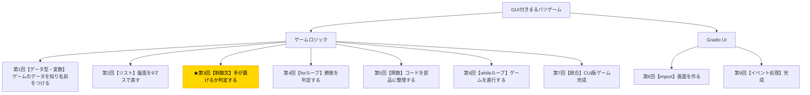

# Python入門オンデマンド講座 第3回：手が置けるか判定しよう【制御文】

## 構成

| セクション | 内容 | 目安時間 |
|---|---|---|
| 導入 | 木構造で現在地確認・今回の目標提示 | 1分 |
| 講義前半 | if/elif/else・比較演算子・論理演算子・手番切替ロジック | 6分 |
| 講義後半 | 演習：手の有効性判定と手番切替のコードを書く | 3分 |
| まとめ | 要点整理・現在地確認・次回予告 | 1分 |

---

## スクリプト

### 導入（1分）

【木構造図を見せる。B3ノードを強調表示する】



第3回へようこそ。今回取り組むのは「手が置けるか判定する」という部分です。

ゲームにはルールがあります。「すでに埋まっているマスには置けない」「0〜8の範囲外の番号は指定できない」といったルールを、プログラムで判断できるようにする必要があります。この「判断する」という仕組みが**制御文（if文）**です。

今回の小目標は、**「条件分岐を使って手の有効性を判定し、手番を切り替えるロジックを書くこと」**です。

---

### 講義前半（6分）

#### プログラムに「判断」をさせる

これまでのプログラムは、書いたコードを上から順番に実行するだけでした。しかし「もし〇〇なら△△する、そうでなければ□□する」という**条件によって処理を変える**ためには、制御文が必要です。

Pythonの制御文の基本構文はこうです。

【コードスライドを見せる】

```python
if 条件:
    条件が真のときの処理
elif 別の条件:
    別の条件が真のときの処理
else:
    どれも当てはまらないときの処理
```

Pythonでは**インデント（字下げ）**でブロックを表します。`if`の下は必ず半角スペース4つでインデントしてください。これはPythonの重要なルールです。

#### 比較演算子

条件式には「比較演算子」を使います。代表的なものを見てみましょう。

| 演算子 | 意味 | 例 |
|---|---|---|
| `==` | 等しい | `x == "X"` |
| `!=` | 等しくない | `x != "O"` |
| `<` | より小さい | `pos < 0` |
| `>` | より大きい | `pos > 8` |
| `<=` | 以下 | `pos <= 8` |
| `>=` | 以上 | `pos >= 0` |

#### 論理演算子

複数の条件を組み合わせるときは「論理演算子」を使います。

| 演算子 | 意味 | 例 |
|---|---|---|
| `and` | 両方が真のとき | `pos >= 0 and pos <= 8` |
| `or` | どちらかが真のとき | `x == "X" or x == "O"` |
| `not` | 真偽を反転させる | `not board[pos] == " "` |

#### 手の有効性を判定する

それではまるバツゲームに必要な判定を実装してみましょう。プレイヤーが指定した位置`pos`が「有効な手かどうか」を判定するには、2つの条件をチェックする必要があります。

1. `pos`が0以上8以下の範囲内か
2. そのマスがまだ空いているか（`board[pos] == " "`）

【コード実演：Colabで以下を入力・実行する】

```python
board = [" "] * 9
board[0] = "X"

pos = 0  # 試しに0番（すでにXが置かれているマス）を指定

if pos < 0 or pos > 8:
    print("範囲外の番号です")
elif board[pos] != " ":
    print("そのマスはすでに埋まっています")
else:
    print("有効な手です")
    board[pos] = "X"
```

`pos = 0`（すでに`X`が置かれているマス）で試すと「すでに埋まっています」と表示されましたね。`pos = 4`に変えると「有効な手です」と表示されるはずです。確認してみてください。

#### 手番を切り替えるロジック

次に、手番を切り替えるロジックを見てみましょう。現在の手番が`X`なら次は`O`、`O`なら次は`X`です。

【コード実演：Colabで以下を入力・実行する】

```python
current_player = "X"

if current_player == "X":
    current_player = "O"
else:
    current_player = "X"

print(current_player)  # O
```

これを実行するたびに手番が`X`と`O`の間で切り替わります。

---

### 講義後半 ─ 演習（3分）

それでは演習です。手の有効性判定と手番切り替えを組み合わせたコードを書いてみましょう。

【演習スライドを見せる】

**課題：指定した位置が有効なら手を置き、手番を切り替えてください。**

以下のスケルトンコードの`?`の部分を埋めてください。

```python
board = [" "] * 9
current_player = "X"
pos = 4  # プレイヤーが4番マスを指定

if ? or ?:
    print("範囲外の番号です")
elif ?:
    print("そのマスはすでに埋まっています")
else:
    board[pos] = ?          # マークを置く
    print(f"{pos}番に{current_player}を置きました")

    if current_player == ?:
        current_player = ?
    else:
        current_player = ?
    print(f"次の手番：{current_player}")
```

【解答例を見せる】

```python
board = [" "] * 9
current_player = "X"
pos = 4

if pos < 0 or pos > 8:
    print("範囲外の番号です")
elif board[pos] != " ":
    print("そのマスはすでに埋まっています")
else:
    board[pos] = current_player
    print(f"{pos}番に{current_player}を置きました")

    if current_player == "X":
        current_player = "O"
    else:
        current_player = "X"
    print(f"次の手番：{current_player}")
```

---

### まとめ（1分）

今回学んだことを振り返りましょう。

- `if` / `elif` / `else`を使うと、条件によって処理を変えられる
- `==`・`!=`・`<`・`>`などの**比較演算子**で条件式を書く
- `and`・`or`・`not`の**論理演算子**で複数の条件を組み合わせられる
- Pythonでは**インデント（4スペース）**でブロックを区切る

これでプログラムに「判断力」が加わりました。「有効な手かどうか」「どちらの手番か」をプログラムが自動で判定できるようになりましたね。

**次回は「forループ」を学び、8通りの勝利パターンを巡回して勝敗を判定するロジックを作ります。**

【木構造図を再表示し、次回のB4ノードを示す】

お疲れさまでした！
