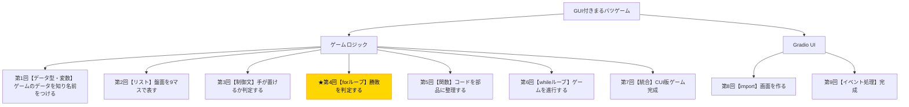

# Python入門オンデマンド講座 第4回：勝敗を判定しよう【forループ】

## 構成

| セクション | 内容 | 目安時間 |
|---|---|---|
| 導入 | 木構造で現在地確認・今回の目標提示 | 1分 |
| 講義前半 | for文・リストのリスト・range()・勝敗判定ロジック | 6分 |
| 講義後半 | 演習：勝者チェック＋引き分けチェックのコードを書く | 3分 |
| まとめ | 要点整理・現在地確認・次回予告 | 1分 |

---

## スクリプト

### 導入（1分）

【木構造図を見せる。B4ノードを強調表示する】



第4回へようこそ。今回はゲームの核心である「勝敗判定」を実装します。

まるバツゲームの勝利条件は「縦・横・斜めのいずれかのラインを3マス同じマークで埋めること」ですね。これを判定するために**「forループ」**を使います。

今回の小目標は、**「forループで8つの勝利パターンを巡回し、勝敗・引き分けを判定するロジックを書くこと」**です。

---

### 講義前半（6分）

#### forループとは

`for`ループは、リストなどの集まりに入っている要素を1つずつ順番に取り出して、同じ処理を繰り返す構文です。

【コードスライドを見せる】

```python
colors = ["red", "green", "blue"]
for color in colors:
    print(color)
```

このコードを実行すると`red`・`green`・`blue`が順番に表示されます。変数`color`に`"red"`・`"green"`・`"blue"`が順番に入り、`print(color)`が3回実行されるイメージです。

#### range()で連番を繰り返す

`range()`を使うと、数値の連番を簡単に生成できます。

【コード実演：Colabで以下を入力・実行する】

```python
for i in range(9):
    print(i)
```

`range(9)`は0から8までの整数を順番に生成します。これを使えば「0番から8番まで全マスを調べる」という操作が書けます。

#### リストのリストで勝利パターンを定義する

まるバツゲームには、勝利できるラインが全部で8通りあります。

```
横3本：[0,1,2]  [3,4,5]  [6,7,8]
縦3本：[0,3,6]  [1,4,7]  [2,5,8]
斜め2本：[0,4,8]  [2,4,6]
```

【盤面の図とラインのスライドを見せる】

この8通りのパターンを「リストのリスト」として定義します。

【コード実演：Colabで以下を入力・実行する】

```python
winning_patterns = [
    [0, 1, 2],  # 上段横
    [3, 4, 5],  # 中段横
    [6, 7, 8],  # 下段横
    [0, 3, 6],  # 左縦
    [1, 4, 7],  # 中縦
    [2, 5, 8],  # 右縦
    [0, 4, 8],  # 左斜め
    [2, 4, 6],  # 右斜め
]
```

`winning_patterns`はリストの中にリストが入っている構造で、各内部リストが1つの勝利ラインを表します。

#### forループで勝者を判定する

このパターンリストを`for`でひとつずつ確認することで、勝者を判定できます。

考え方はシンプルです。あるパターン`[a, b, c]`について、`board[a]`・`board[b]`・`board[c]`が全て同じマーク（かつ空きでない）なら、そのマークのプレイヤーが勝ちです。

【コード実演：Colabで以下を入力・実行する】

```python
board = ["X", "X", "X", " ", "O", " ", " ", " ", "O"]
winner = None  # 勝者がいない状態を None で表す

for pattern in winning_patterns:
    a, b, c = pattern[0], pattern[1], pattern[2]
    if board[a] == board[b] == board[c] and board[a] != " ":
        winner = board[a]
        break  # 勝者が見つかったら終了

print(winner)  # X
```

`winner = None`は「まだ勝者がいない」状態を表します。勝者が見つかったら`winner`にそのマークを代入し、`break`でループを終了します。

#### 引き分けを判定する

引き分けは「全マスが埋まっていて、かつ勝者がいない」状態です。

前回学んだ`in`演算子を使うと、「盤面に空きマスが残っているか」が一行で確認できます。

【コード実演：Colabで以下を入力・実行する】

```python
board = ["X", "O", "X", "O", "X", "O", "O", "X", "O"]  # 全マス埋まった盤面

if " " not in board:
    print("引き分け")
else:
    print("ゲーム継続中")
```

`" " not in board`が`True`のとき（空きマスがないとき）は引き分けです。

---

### 講義後半 ─ 演習（3分）

それでは演習です。勝者チェックと引き分けチェックを組み合わせて、ゲームの状態を判定するコードを書いてみましょう。

【演習スライドを見せる】

**課題：盤面の状態を見て「Xの勝ち」「Oの勝ち」「引き分け」「継続中」を判定してください。**

```python
winning_patterns = [
    [0, 1, 2], [3, 4, 5], [6, 7, 8],
    [0, 3, 6], [1, 4, 7], [2, 5, 8],
    [0, 4, 8], [2, 4, 6],
]

board = ["X", "X", "X", "O", "O", " ", " ", " ", " "]  # テスト用盤面

winner = None

# 勝者をチェックするforループを書いてください
for ? in ?:
    a, b, c = ?[0], ?[1], ?[2]
    if ? == ? == ? and ? != " ":
        winner = ?
        break

# 結果を表示
if winner:
    print(f"{winner}の勝ち！")
elif ? not in board:
    print("引き分け！")
else:
    print("ゲーム継続中")
```

【解答例を見せる】

```python
winner = None

for pattern in winning_patterns:
    a, b, c = pattern[0], pattern[1], pattern[2]
    if board[a] == board[b] == board[c] and board[a] != " ":
        winner = board[a]
        break

if winner:
    print(f"{winner}の勝ち！")
elif " " not in board:
    print("引き分け！")
else:
    print("ゲーム継続中")
```

`board`の内容を書き換えて、いろんな盤面で試してみてください。

---

### まとめ（1分）

今回学んだことを振り返りましょう。

- `for 変数 in リスト:`でリストの要素を1つずつ処理できる
- `range(9)`で0〜8の連番を生成できる
- リストのリストを使うと、複数のパターンをデータとして管理できる
- `break`でループを途中で終了できる
- `None`は「値がない」状態を表す

繰り返しを使うことで、8通りの勝利パターンを1つずつ手動でチェックすることなく、スッキリしたコードで判定できましたね。

コードが少しずつ長くなってきました。**次回は「関数」を学び、これまで書いてきたコードを部品に整理します。**

【木構造図を再表示し、次回のB5ノードを示す】

お疲れさまでした！
