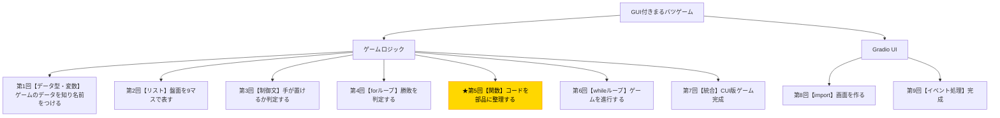

# Python入門オンデマンド講座 第5回：コードを部品に整理しよう【関数】

## 構成

| セクション | 内容 | 目安時間 |
|---|---|---|
| 導入 | 木構造で現在地確認・今回の目標提示 | 1分 |
| 講義前半 | def・引数・return・関数呼び出し・リファクタリング | 6分 |
| 講義後半 | 演習：スケルトンコードに関数を実装する | 3分 |
| まとめ | 要点整理・現在地確認・次回予告 | 1分 |

---

## スクリプト

### 導入（1分）

【木構造図を見せる。B5ノードを強調表示する】



第5回へようこそ。今回は**「関数」**を学びます。

第1回から第4回にかけて、変数・リスト・制御文・forループを学び、ゲームの各ロジックを少しずつ書いてきました。しかしそのままでは、すべてのコードがひとつの場所に散在していて、読みにくく再利用も難しい状態です。

今回の小目標は、**「これまで書いたフラットなコードを関数という部品にまとめ、再利用可能にすること」**です。

---

### 講義前半（6分）

#### 関数とは何か

関数とは、**複数の処理に名前をつけてひとまとめにしたもの**です。一度定義すれば、その名前を呼ぶだけで何度でも同じ処理を実行できます。

身近な例えで言うと、「お茶を入れる」という一連の動作（カップを用意する・お湯を沸かす・茶葉を入れる……）を、「お茶を入れて」というひとことで頼める状態にする、というイメージです。

#### 関数の定義構文

Pythonで関数を定義するには`def`キーワードを使います。

【コードスライドを見せる】

```python
def 関数名(引数1, 引数2):
    処理
    return 戻り値
```

- `def`：関数を定義するキーワード
- **引数（ひきすう）**：関数に渡す入力データ
- `return`：関数が返す出力データ（戻り値）

#### 最初の例：盤面を表示する関数

まず、第2回で書いた盤面の表示コードを関数にしてみましょう。

【コード実演：Colabで以下を入力・実行する】

```python
def display_board(board):
    print(f" {board[0]} | {board[1]} | {board[2]} ")
    print("-----------")
    print(f" {board[3]} | {board[4]} | {board[5]} ")
    print("-----------")
    print(f" {board[6]} | {board[7]} | {board[8]} ")
```

関数を定義しただけでは何も起きません。関数を実行するには**「呼び出し」**が必要です。

```python
board = [" "] * 9
board[0] = "X"
board[4] = "O"

display_board(board)  # 関数を呼び出す
```

`display_board(board)`と書くだけで、どこからでも盤面を表示できるようになりました。

#### 引数と戻り値のある関数

次に、「引数を受け取り、戻り値を返す」関数を見てみましょう。手番を切り替える処理を関数にします。

【コード実演：Colabで以下を入力・実行する】

```python
def switch_player(current_player):
    if current_player == "X":
        return "O"
    else:
        return "X"

player = "X"
player = switch_player(player)  # "O"が戻ってくる
print(player)  # O
```

`return`で値を返し、呼び出し側でその戻り値を受け取ることができます。

#### 今回定義する関数一覧

今回の演習では、これまで書いてきたロジックを以下の関数に整理します。

| 関数名 | 役割 |
|---|---|
| `initialize_game()` | 盤面と手番を初期化する |
| `display_board(board)` | 盤面を3×3で表示する |
| `is_valid_move(board, position)` | 手が有効かどうか判定する |
| `place_mark(board, position, player)` | 盤面にマークを置く |
| `switch_player(current_player)` | 手番を切り替える |
| `check_winner(board)` | 勝者を返す（いなければNone） |
| `check_draw(board)` | 引き分けかどうかを返す |

これらが揃えば、次回のwhileループから「関数を呼ぶだけ」でゲームを進行できるようになります。

---

### 講義後半 ─ 演習（3分）

それでは演習です。スケルトンコードの`pass`の部分を埋めて、各関数を実装してみましょう。

【演習スライドを見せる。スケルトンコードを提示する】

```python
winning_patterns = [
    [0,1,2],[3,4,5],[6,7,8],
    [0,3,6],[1,4,7],[2,5,8],
    [0,4,8],[2,4,6],
]

def initialize_game():
    board = [" "] * 9
    current_player = "X"
    return board, current_player

def display_board(board):
    pass  # 3×3で盤面を表示する

def is_valid_move(board, position):
    pass  # True または False を返す

def place_mark(board, position, player):
    pass  # board[position] にマークを置く

def switch_player(current_player):
    pass  # "X"なら"O"、"O"なら"X"を返す

def check_winner(board):
    pass  # 勝者のマーク（"X"か"O"）またはNoneを返す

def check_draw(board):
    pass  # 引き分けならTrue、そうでなければFalseを返す
```

まずは`display_board`・`is_valid_move`・`switch_player`から実装してみてください。

【解答例を見せる】

```python
def display_board(board):
    print(f" {board[0]} | {board[1]} | {board[2]} ")
    print("-----------")
    print(f" {board[3]} | {board[4]} | {board[5]} ")
    print("-----------")
    print(f" {board[6]} | {board[7]} | {board[8]} ")

def is_valid_move(board, position):
    if position < 0 or position > 8:
        return False
    return board[position] == " "

def place_mark(board, position, player):
    board[position] = player

def switch_player(current_player):
    if current_player == "X":
        return "O"
    return "X"

def check_winner(board):
    for pattern in winning_patterns:
        a, b, c = pattern[0], pattern[1], pattern[2]
        if board[a] == board[b] == board[c] and board[a] != " ":
            return board[a]
    return None

def check_draw(board):
    return " " not in board
```

---

### まとめ（1分）

今回学んだことを振り返りましょう。

- `def 関数名(引数):`で関数を定義する
- `return`で値を返す。`return`のない関数は`None`を返す
- 一度定義した関数は何度でも呼び出せる（再利用）
- コードを関数に分けると、読みやすく・テストしやすく・管理しやすくなる

これまで散在していたロジックが、7つの部品（関数）として整理されました。

**次回は「whileループ」を学び、これらの関数を組み合わせてゲームを実際に動かします。CUI版のゲームがいよいよ完成に近づきます！**

【木構造図を再表示し、次回のB6ノードを示す】

お疲れさまでした！
