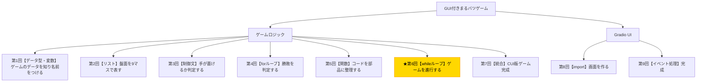

# Python入門オンデマンド講座 第6回：ゲームを繰り返し進行しよう【whileループ】

## 構成

| セクション | 内容 | 目安時間 |
|---|---|---|
| 導入 | 木構造で現在地確認・今回の目標提示 | 1分 |
| 講義前半 | while True・break・continue・input()・int()変換 | 6分 |
| 講義後半 | 演習：play_game()関数を組み立てる | 3分 |
| まとめ | 要点整理・現在地確認・次回予告 | 1分 |

---

## スクリプト

### 導入（1分）

【木構造図を見せる。B6ノードを強調表示する】



第6回へようこそ。前回で、ゲームに必要なすべての関数が揃いました。あとは、それらを「繰り返す仕組み」でつなぎ合わせるだけです。

今回学ぶ**whileループ**を使えば、プレイヤーの入力を受け取り→盤面を更新し→勝敗を確認する、という1ターンの処理を何度も繰り返すことができます。

今回の小目標は、**「whileループでゲームを1ターンずつ進行させ、Colab上でCUI版マルバツゲームを動かすこと」**です。

---

### 講義前半（6分）

#### whileループとは

`while`ループは、**ある条件が真である間、処理を繰り返す**構文です。

【コードスライドを見せる】

```python
while 条件:
    繰り返す処理
```

`for`ループがリストの要素数だけ繰り返すのに対して、`while`ループは「条件が満たされている限り」繰り返し続けます。ゲームのように「ゲームが終わるまでずっと繰り返す」という状況に適しています。

#### while True と break

ゲームループでよく使われるパターンが`while True`です。`True`は常に真なので、このループは何もしなければ永遠に繰り返します。ループを終了させるには`break`を使います。

【コード実演：Colabで以下を入力・実行する】

```python
count = 0
while True:
    print(f"カウント: {count}")
    count += 1
    if count >= 3:
        break  # ループを終了する
```

`break`に到達するとループが終了します。ゲームでは「勝者が決まった」か「引き分けになった」タイミングで`break`します。

#### continue でスキップする

`continue`はループの残りの処理をスキップして、次の繰り返しの先頭に戻ります。ゲームでは「無効な手を入力されたとき、入力をやり直させる」ために使います。

【コード実演：Colabで以下を入力・実行する】

```python
for i in range(5):
    if i == 2:
        continue  # i==2 のときだけスキップ
    print(i)
# 出力：0 1 3 4
```

#### input()でユーザー入力を受け取る

ゲームは「プレイヤーの入力を待つ」必要があります。Pythonの`input()`関数を使うと、キーボードからの入力を受け取れます。

【コード実演：Colabで以下を入力・実行する】

```python
text = input("番号を入力してください（0〜8）：")
print(f"あなたが入力した値：{text}")
print(type(text))  # <class 'str'>
```

注意点として、**`input()`が返す値は必ず文字列（str）型**です。そのため、数値として使いたい場合は`int()`で整数に変換する必要があります。

```python
text = input("番号を入力してください：")
pos = int(text)  # 文字列 → 整数
print(pos + 1)   # 数値として計算できる
```

ただし、`"abc"`のような数字以外の文字列を`int()`に渡すとエラーになります。本格的な入力チェックには`try`/`except`を使いますが、今回は数字が入力される前提で進めます。

#### ゲームループの全体像

以上の要素を組み合わせると、ゲームループはこういう構造になります。

【フローチャートスライドを見せる】

```
while True:
    1. 盤面を表示する
    2. プレイヤーの入力を受け取る
    3. 有効な手かチェック → 無効なら continue
    4. 盤面にマークを置く
    5. 勝者チェック → 勝者がいればメッセージを出してbreak
    6. 引き分けチェック → 引き分けならメッセージを出してbreak
    7. 手番を切り替える → while Trueの先頭に戻る
```

---

### 講義後半 ─ 演習（3分）

それでは演習です。上記の構造をもとに、`play_game()`関数を完成させてください。

【演習スライドを見せる。スケルトンコードを提示する】

```python
def play_game():
    board, current_player = initialize_game()

    while True:
        display_board(board)
        print(f"{current_player}の番です")

        pos = int(input("置く場所を入力してください（0〜8）："))

        if not is_valid_move(?, ?):
            print("そこには置けません。もう一度入力してください。")
            continue

        place_mark(?, ?, ?)

        winner = check_winner(?)
        if winner:
            display_board(board)
            print(f"{winner}の勝ち！")
            break

        if check_draw(?):
            display_board(board)
            print("引き分けです！")
            break

        current_player = switch_player(?)
```

`?`の部分を、前回定義した関数の引数を参考にしながら埋めてみてください。

【解答例を見せる】

```python
def play_game():
    board, current_player = initialize_game()

    while True:
        display_board(board)
        print(f"{current_player}の番です")

        pos = int(input("置く場所を入力してください（0〜8）："))

        if not is_valid_move(board, pos):
            print("そこには置けません。もう一度入力してください。")
            continue

        place_mark(board, pos, current_player)

        winner = check_winner(board)
        if winner:
            display_board(board)
            print(f"{winner}の勝ち！")
            break

        if check_draw(board):
            display_board(board)
            print("引き分けです！")
            break

        current_player = switch_player(current_player)

play_game()
```

実際に実行して、Colab上でまるバツゲームを遊んでみましょう！

---

### まとめ（1分）

今回学んだことを振り返りましょう。

- `while 条件:`で条件が真の間、処理を繰り返す
- `while True:`で無限ループを作り、`break`で終了する
- `continue`でループの残りをスキップして次の繰り返しへ進む
- `input()`でキーボード入力を受け取り、`int()`で整数に変換する

Colab上でCUI版のまるバツゲームが動きましたね！でも、毎回最初からしか遊べない……そこを次回改善します。

**次回は「統合・仕上げ」回です。リプレイ機能を追加し、CUI版ゲームを完成させます！**

【木構造図を再表示し、次回のB7ノードを示す】

お疲れさまでした！
