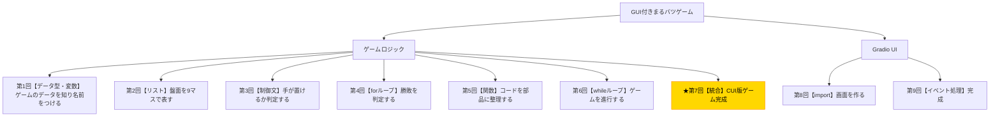

# Python入門オンデマンド講座 第7回：CUI版ゲームを仕上げよう【統合・仕上げ】

## 構成

| セクション | 内容 | 目安時間 |
|---|---|---|
| 導入 | 木構造で現在地確認・今回の目標提示 | 1分 |
| 講義前半 | リプレイ機能の実装・全コードの流れを図解で復習 | 6分 |
| 講義後半 | 演習：リプレイ機能を追加してCUI版完成 | 3分 |
| まとめ | 要点整理・現在地確認・次回予告 | 1分 |

---

## スクリプト

### 導入（1分）

【木構造図を見せる。B7ノードを強調表示する】



第7回へようこそ。今回は新しい文法を学ぶというより、これまでの知識を統合して**CUI版ゲームを完成させる**回です。

前回、`play_game()`でゲームが1回遊べるようになりました。でも1回終わるとゲームが終了してしまいます。今回は「もう一度遊ぶ？」を聞いてリプレイできる機能を追加し、コード全体の仕上げをします。

今回の小目標は、**「リプレイ機能を追加し、CUI版マルバツゲームを完成させること」**です。

---

### 講義前半（6分）

#### 全コードの流れを振り返る

まず、第1回から第6回で作った関数の全体像を確認しましょう。

【全関数の一覧スライドを見せる】

```
initialize_game()     ← 第5回で定義
display_board()       ← 第5回で定義
is_valid_move()       ← 第5回で定義
place_mark()          ← 第5回で定義
switch_player()       ← 第5回で定義
check_winner()        ← 第5回で定義
check_draw()          ← 第5回で定義
play_game()           ← 第6回で定義
```

各関数の役割を簡単におさらいしましょう。`initialize_game()`は盤面と手番を初期化して返します。`display_board(board)`は盤面を3×3で表示します。`is_valid_move(board, position)`は指定位置が有効な手かどうかを判定し`True`か`False`を返します。`place_mark(board, position, player)`は盤面の指定マスにマークを置きます。`check_winner(board)`は勝者のマークか`None`を返します。`check_draw(board)`は引き分けかどうかを返します。そして`play_game()`がこれら全てを使ってゲームを1回進行させます。

#### リプレイ機能の設計

1回のゲームが終わった後「もう一度遊びますか？」と聞き、「yes」なら再びゲームを開始し、「no」なら終了するという仕組みです。これは「ゲームの外側にもう1つwhileループを追加する」ことで実現できます。

【図解スライドを見せる：入れ子のループ構造】

```
play_game_loop():             ← 外側のループ（リプレイ管理）
    while True:
        play_game()           ← 内側のループ（1ゲームの進行）
        "もう一度？" を聞く
        "no" なら break
```

#### play_game_loop() の実装

【コード実演：Colabで以下を入力・実行する】

```python
def play_game_loop():
    print("まるバツゲームへようこそ！")

    while True:
        play_game()

        again = input("もう一度遊びますか？（yes / no）：").strip().lower()
        if again != "yes":
            print("ありがとうございました！またね！")
            break
```

`.strip()`は入力の前後の空白を取り除き、`.lower()`は小文字に統一します。「YES」「Yes」などの表記ゆれに対応するためです。

#### 全コードの最終確認

今回のCUI版完成形のコード全体を確認しましょう。

【全コードのスライドを見せる】

コードの量が増えてきましたが、それぞれの関数が独立した部品として整理されているため、全体の流れは非常に明確です。プログラムの動作は下から上に辿ると理解しやすいです。

- 一番外側の`play_game_loop()`を呼ぶ
- `play_game_loop()`は`play_game()`を繰り返し呼ぶ
- `play_game()`は各ターンで`display_board`・`is_valid_move`・`place_mark`・`check_winner`・`check_draw`・`switch_player`を呼ぶ

こうした「大きな関数が小さな関数を呼ぶ」という構造が、プログラムの基本的な設計パターンです。

---

### 講義後半 ─ 演習（3分）

それでは演習です。これまでのすべての関数コードと、`play_game_loop()`を含む完成版コードを1つのセルにまとめて実行してみましょう。

【演習スライドを見せる】

**課題：以下のスケルトンにコードを埋めて、完成版CUI版まるバツゲームを動かしてください。**

```python
winning_patterns = [
    [0,1,2],[3,4,5],[6,7,8],
    [0,3,6],[1,4,7],[2,5,8],
    [0,4,8],[2,4,6],
]

def initialize_game():    ...
def display_board(board): ...
def is_valid_move(board, position): ...
def place_mark(board, position, player): ...
def switch_player(current_player): ...
def check_winner(board): ...
def check_draw(board): ...
def play_game(): ...

def play_game_loop():
    print("まるバツゲームへようこそ！")
    while True:
        play_game()
        again = input("もう一度遊びますか？（yes / no）：").strip().lower()
        if again != "yes":
            print("ありがとうございました！またね！")
            break

play_game_loop()
```

第5回・第6回のコードをそれぞれコピーして埋めてください。完成したら実際に遊んでみましょう！

【実行している様子を画面で見せる】

---

### まとめ（1分）

今回でゲームロジックが完成しました！

今回新たに学んだことは少ないですが、重要なことを確認しました。

- 関数を組み合わせることで、複雑な処理もシンプルに記述できる
- ループを入れ子にすることで、「ゲームのリプレイ」のような階層的な繰り返しが実現できる
- `.strip()`・`.lower()`のようなメソッドで入力の揺れに対応できる

第1回から第7回で学んだ変数・リスト・制御文・forループ・関数・whileループ、この6つの文法でゲームロジックが完成しました。

**次回からはGradioを使って、このロジックに「見た目」を与えます。GUI付きのまるバツゲームへ、いよいよ最終章です！**

【木構造図を再表示し、次回のC1ノードを示す】

お疲れさまでした！
