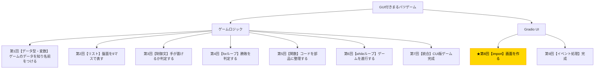

# Python入門オンデマンド講座 第8回：Gradioで画面を作ろう【import・Gradio基礎】

## 構成

| セクション | 内容 | 目安時間 |
|---|---|---|
| 導入 | 木構造で現在地確認・今回の目標提示 | 1分 |
| 講義前半 | importの仕組み・Gradioの基本構成・コンポーネントの配置 | 6分 |
| 講義後半 | 演習：ボタン9個＋ステータス＋リセットのUI骨組みを作る | 3分 |
| まとめ | 要点整理・現在地確認・次回予告 | 1分 |

---

## スクリプト

### 導入（1分）

【木構造図を見せる。C1ノードを強調表示する】



第8回へようこそ。今回から最終章「Gradio UI」に入ります。

木構造図を見ると、これまで第1回〜第7回で「ゲームロジック」の枝をすべて作り終えました。今回はついに「Gradio UI」の枝に進みます。ゲームに「見た目」を与える段階です。

今回の小目標は、**「Gradioを使ってボタン9個＋ステータス表示＋リセットボタンのUI骨組みを作ること」**です。

---

### 講義前半（6分）

#### importとは何か

Pythonには「ライブラリ」と呼ばれる、便利な機能をまとめたパッケージが数多く存在します。`import`文を使うことで、そのライブラリの機能を自分のプログラムで使えるようになります。

【コードスライドを見せる】

```python
import ライブラリ名
import ライブラリ名 as 省略名
```

よく使われる書き方として、Gradioは`gr`という省略名でインポートするのが一般的です。

```python
import gradio as gr
```

これにより、`gr.Button()`・`gr.Textbox()`のように`gr.`を先頭につけてGradioの機能を呼び出せます。

Colabでは初回のみインストールが必要です。

```python
!pip install gradio
import gradio as gr
```

#### Gradioとは

Gradioは、Pythonで手軽にWebベースのUIを作成できるライブラリです。複雑なHTML・CSS・JavaScriptの知識がなくても、Pythonコードだけで見栄えの良いインターフェースが作れます。

【Gradioの公式デモやサンプルのスライドを見せる】

#### gr.Blocksによる画面構成

Gradioで自由なレイアウトを作るには`gr.Blocks()`を使います。`with gr.Blocks() as app:`という書き方で、UIの「設計図」を記述します。

【コード実演：Colabで以下を入力・実行する】

```python
import gradio as gr

with gr.Blocks() as app:
    gr.Markdown("# まるバツゲーム")

app.launch()
```

これを実行すると、ブラウザ上に「まるバツゲーム」と表示されるシンプルなページが立ち上がります。

#### 主要なコンポーネント

Gradioには様々なUIコンポーネントがあります。今回使うものを確認しましょう。

| コンポーネント | 役割 |
|---|---|
| `gr.Button("ラベル")` | クリックできるボタン |
| `gr.Textbox(label="ラベル")` | テキストの表示・入力欄 |
| `gr.Row()` | コンポーネントを横並びにする |
| `gr.Markdown("テキスト")` | マークダウンテキストの表示 |

#### ボタンを3×3に並べる

まるバツゲームの盤面は、ボタンを3行3列に並べることで表現します。

【コード実演：Colabで以下を入力・実行する】

```python
import gradio as gr

with gr.Blocks() as app:
    gr.Markdown("# まるバツゲーム")

    # 盤面：3×3のボタン
    with gr.Row():
        btn0 = gr.Button(" ")
        btn1 = gr.Button(" ")
        btn2 = gr.Button(" ")
    with gr.Row():
        btn3 = gr.Button(" ")
        btn4 = gr.Button(" ")
        btn5 = gr.Button(" ")
    with gr.Row():
        btn6 = gr.Button(" ")
        btn7 = gr.Button(" ")
        btn8 = gr.Button(" ")

    # ステータス表示
    status = gr.Textbox(label="ゲーム状態", value="Xの番です", interactive=False)

    # リセットボタン
    reset_btn = gr.Button("リセット")

app.launch()
```

`with gr.Row():`の中に並べたコンポーネントは横並びになります。これを3回繰り返すことで3×3のグリッドができます。

---

### 講義後半 ─ 演習（3分）

それでは演習です。上記のコードを自分で入力して実行してみてください。

【演習スライドを見せる】

**課題：以下のUI骨組みを自力で作成し、Colabで動作確認してください。**

必要な要素は以下の4つです。

1. タイトル（`gr.Markdown`）
2. 3×3のボタン（`gr.Button`を`gr.Row`で3行に配置）
3. ゲーム状態を表示するテキストボックス（`gr.Textbox`）
4. リセットボタン（`gr.Button`）

まだボタンをクリックしても何も起きませんが、画面のレイアウトが正しく表示されればOKです。

【動作確認のポイントを示す】

- Colabのセルを実行すると「Running on local URL: ...」というリンクが表示される
- そのリンクをクリックするか、セルの下に表示されるUI画面を確認する
- 9つのボタンと「リセット」ボタン、ステータス表示が見えていれば成功！

【解答例と完成後のUI画面スクリーンショットを見せる】

---

### まとめ（1分）

今回学んだことを振り返りましょう。

- `import gradio as gr`でGradioライブラリを読み込む
- `with gr.Blocks() as app:`でUIの設計図を作る
- `gr.Button()`・`gr.Textbox()`・`gr.Row()`などのコンポーネントでレイアウトを組む
- `app.launch()`でアプリを起動する

UIは「ゲームロジックの見せ方を変える層」です。内部のロジックは変えずに、見た目だけを追加するのがポイントです。

今回は「見た目」だけを作りました。ボタンをクリックしてもまだ何も起きません。**次回はボタンクリックとロジック関数を接続し、ゲームを完成させます！**

【木構造図を再表示し、次回のC2ノードを示す】

お疲れさまでした！
