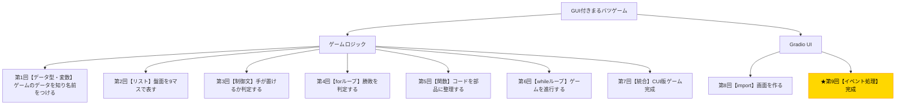

# Python入門オンデマンド講座 第9回：GUIとロジックをつないで完成させよう【イベント処理】

## 構成

| セクション | 内容 | 目安時間 |
|---|---|---|
| 導入 | 木構造で現在地確認・「今日で完成する」ことを明示 | 1分 |
| 講義前半 | イベント駆動・コールバック・gr.State・.click()の接続 | 6分 |
| 講義後半 | 演習：クリック処理とリセット処理を接続して完成版を仕上げる | 3分 |
| まとめ | 完成の振り返り・発展課題の紹介 | 1分 |

---

## スクリプト

### 導入（1分）

【木構造図を見せる。C2ノードを強調表示する】



第9回へようこそ。いよいよ最終回です！

木構造図の最後のノード、「イベント処理・完成」です。前回作ったUI骨組みのボタンはまだ何もしません。今回はそのボタンとゲームロジックをつないで、**GUI付きまるバツゲームを完成させます**。

今回の小目標は、**「ボタンクリック時にロジック関数を呼び出し、結果をUIに反映させること」**です。

---

### 講義前半（6分）

#### イベント駆動プログラミングとは

これまでのCUI版ゲームは「上から順番にコードを実行する」という流れでした。しかしGUIアプリは違います。**「ユーザーがボタンをクリックした」「リセットボタンが押された」といった「イベント」が発生したときに、対応する処理（コールバック関数）が呼ばれる**という仕組みで動きます。

これを**イベント駆動プログラミング**と呼びます。

【図解スライドを見せる】

```
ユーザーがボタンをクリック
        ↓
「クリックイベント」が発生
        ↓
登録されたコールバック関数が呼ばれる
        ↓
戻り値がUIに反映される
```

#### gr.Stateでゲームの状態を保持する

GUIアプリでは、ボタンがクリックされるたびにコールバック関数が呼ばれます。しかし「盤面の状態」や「今の手番」といった情報は、クリックをまたいで保持し続けなければなりません。

Gradioでは`gr.State()`を使うと、複数回のイベントをまたいで値を保持できます。

【コードスライドを見せる】

```python
board_state = gr.State(value=[" "] * 9)
player_state = gr.State(value="X")
```

`board_state`には盤面リストが、`player_state`には手番が保存されます。コールバック関数がこれらを受け取って更新し、返すことで状態が維持されます。

#### .click()でコールバックを登録する

GradioでボタンにコールバックをつけるにはCは`.click()`メソッドを使います。

```python
ボタン変数.click(
    fn=コールバック関数,
    inputs=[入力コンポーネントのリスト],
    outputs=[出力コンポーネントのリスト]
)
```

- `fn`：ボタンが押されたときに呼ぶ関数
- `inputs`：関数に渡す入力値（Stateやコンポーネント）
- `outputs`：関数の戻り値で更新するコンポーネント

#### コールバック関数の設計

0番ボタンが押されたときの処理を例にしてみます。

【コードスライドを見せる】

```python
def on_click(position, board, current_player):
    if not is_valid_move(board, position):
        # ボタンのラベルと状態を変えずに返す
        return board[0], board[1], ..., board[8], current_player, "そこには置けません"

    place_mark(board, position, current_player)
    winner = check_winner(board)
    if winner:
        btn_labels = board[:]
        return *btn_labels, board, current_player, f"{winner}の勝ち！"

    if check_draw(board):
        return *board[:], board, current_player, "引き分け！"

    next_player = switch_player(current_player)
    return *board[:], board, next_player, f"{next_player}の番です"
```

ポイントは、**コールバック関数の戻り値がそのまま画面の表示更新に使われる**という点です。ボタンのラベル（表示テキスト）・State・ステータステキストをまとめて返します。

#### 9つのボタンを効率よく接続する

9つのボタンのそれぞれに個別のコールバックを書くのは大変です。Pythonの関数の性質を使って、「ポジション番号を閉じ込めた関数」を動的に作成することで効率化できます。

【コードスライドを見せる】

```python
buttons = [btn0, btn1, ..., btn8]

for i, btn in enumerate(buttons):
    def make_handler(pos):
        def handler(board, player):
            return on_click(pos, board, player)
        return handler

    btn.click(
        fn=make_handler(i),
        inputs=[board_state, player_state],
        outputs=buttons + [board_state, player_state, status]
    )
```

---

### 講義後半 ─ 演習（3分）

それでは演習です。第8回で作ったUI骨組みに、今回学んだイベント処理を追加して完成版を仕上げましょう。

【演習スライドを見せる。完成版スケルトンコードを提示する】

```python
import gradio as gr

winning_patterns = [...]  # 第4回のパターン

# --- ロジック関数（第5回のコードをそのまま使う）---
def initialize_game(): ...
def is_valid_move(board, position): ...
def place_mark(board, position, player): ...
def switch_player(current_player): ...
def check_winner(board): ...
def check_draw(board): ...

# --- コールバック関数 ---
def on_click(position, board, current_player):
    if not is_valid_move(board, position):
        return [board[i] for i in range(9)] + [board, current_player, "そこには置けません"]

    place_mark(board, position, current_player)
    winner = check_winner(board)
    if winner:
        return [board[i] for i in range(9)] + [board, current_player, f"{winner}の勝ち！"]
    if check_draw(board):
        return [board[i] for i in range(9)] + [board, current_player, "引き分け！"]

    next_player = switch_player(current_player)
    return [board[i] for i in range(9)] + [board, next_player, f"{next_player}の番です"]

def on_reset():
    board, player = initialize_game()
    return [" "] * 9 + [board, player, "Xの番です"]

# --- UI ---
with gr.Blocks() as app:
    gr.Markdown("# まるバツゲーム")
    board_state = gr.State(value=[" "] * 9)
    player_state = gr.State(value="X")

    buttons = []
    for row in range(3):
        with gr.Row():
            for col in range(3):
                btn = gr.Button(" ")
                buttons.append(btn)

    status = gr.Textbox(label="ゲーム状態", value="Xの番です", interactive=False)
    reset_btn = gr.Button("リセット")

    all_outputs = buttons + [board_state, player_state, status]

    for i, btn in enumerate(buttons):
        def make_handler(pos):
            def handler(board, player):
                return on_click(pos, board, player)
            return handler
        btn.click(fn=make_handler(i), inputs=[board_state, player_state], outputs=all_outputs)

    reset_btn.click(fn=on_reset, inputs=[], outputs=all_outputs)

app.launch()
```

コードを実行して、実際にGUIで遊んでみましょう！

【動作確認のチェックポイントを示す】

- ボタンをクリックするとXまたはOが表示されるか
- 手番が交互に変わるか
- 勝ったときにステータスが「○の勝ち！」と表示されるか
- リセットボタンで盤面が初期化されるか

---

### まとめ（1分）

**おめでとうございます！全9回のカリキュラムが完了しました！**

今回学んだことを振り返りましょう。

- イベント駆動プログラミング：ユーザーの操作に応じて関数が呼ばれる仕組み
- `gr.State()`：複数のイベントをまたいで状態を保持する
- `.click(fn, inputs, outputs)`：ボタンにコールバック関数を登録する
- コールバックの戻り値が画面の更新に直接反映される

第1回から第9回で、変数・リスト・制御文・forループ・関数・whileループ・import・イベント処理という8つのテーマを学び、動くゲームを完成させました。

この講座が終わっても、学習は続きます。たとえば……

- AIと対戦できるCPU機能を追加する
- CSSでデザインをカスタマイズする
- 他のゲーム（オセロ、数字当てゲーム）に挑戦してみる
- データ分析・業務自動化など別分野のPythonを探求する

みなさんがここで得た「自分でもプログラムが書けるんだ」という自信を大切に、これからも学習を続けてください。

**ご受講ありがとうございました！**
