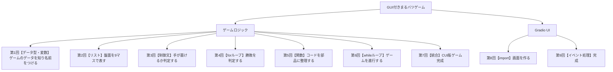

# 講座企画書：Python入門・オンデマンド講座（まるバツゲーム開発で学ぶはじめてのプログラミング）

## 講座概要
本企画は、実際に手元で動く最終成果物（まるバツゲーム）の作成を通して、Python 初学者に自己効力感とそれに起因するPython学習意欲を持たせることを最上位指針とするオンデマンド入門講座である。Google Colab と Gradio を用い、環境構築でつまずかず、初回から動く成果物を体験できる設計とする。

各回では、最終成果物の構成要素となる「モジュール」（例：盤面表示，入力受付，勝敗判定など）を一つずつ作成することを小目標に設定し、その小目標の達成に必要なPythonの文法知識やプログラミング概念を講義する。受講者は、回を重ねるごとに手元でモジュールが積み上がり、最終回には自分の力で動くマルバツゲームが完成するという達成体験を得ることができる。

## 講座の特徴
### ゴール駆動型の設計
本講座最大の特徴は、「最終成果物 → モジュール（小目標） → 必要な文法・概念」というトップダウンの階層構造で講座全体が設計されている点にある。一般的な入門講座では、文法を順番に学んだ後に応用課題に取り組む「ボトムアップ型」の構成が多いが，この方式では受講者が「今なぜこれを学んでいるのか」を見失いやすい。本講座では、常にゴールから逆算して各回の学習内容を定めることで，受講者が学習の目的と現在地を常に把握できるようにしている。

### モジュール積み上げ方式
各回の演習で作成するモジュールは、最終成果物の一部として実際に機能する独立した構成要素である。回を追うごとにモジュールが統合されていくため、受講者は毎回の講座で「自分のゲームが少しずつ完成に近づいている」という手応えを感じることができる。この段階的な達成感が、学習意欲の維持に大きく寄与する。

### 木構造による全体像の可視化
毎回の冒頭で、最終成果物を頂点とする木構造の図を提示し、「全体の中で今回はどの部分を扱うのか」を視覚的に示す。これにより、受講者は個々の学習内容がゲーム全体のどこに位置づけられるかを直感的に理解でき、学習の迷子を防止する。

木構造の図に関しては、mermaid記法で作成する。

## 対象者
プログラミング完全初心者を対象とする。Pythonの環境については、Google Colaboratoryを使用する。

## 最終成果物
gradioを使用したGUI付きまるバツゲーム。

## 各回の進行構成
各回は10分から12分に収めるマイクロラーニングで進めていく。各回の構成・時間内訳は以下の通りに進めていく。

1. 導入（1分）：木構造を用いた全体像の提示。今回作成するモジュールの提示、習得する文法・概念の紹介。
2. 講義前半（6分）：モジュール作成に必要な文法・プログラミング概念の解説（コード例を用いた実演を含む）。
3. 講義後半（2分〜4分）：学んだ知識を活用し、該当モジュールをヒントを与えながら作成してもらう。
4. まとめ（30秒〜1分）：本回の要点整理。次回の予告。全体における現在地の確認。

## 期待される効果
- 目に見える成果物の存在により，受講者の学習意欲が持続する
- モジュール単位の段階的な達成体験により，挫折を防止できる
- ゴール駆動型の構成により，文法学習の目的意識が明確になる
- 最終的に自分で動くアプリケーションを完成させた経験が，その後の学習への自信につながる

## カリキュラム案
本講座は，全9回で最終成果物である「Gradioを使用したGUI付きまるバツゲーム」を完成させる構成とする。講座設計は，最終成果物から必要なモジュールを分解し，そのモジュールを実装するために必要なPython文法・概念を逆算して配置するトップダウン方式で統一する。前半はGoogle Colab上でゲームロジックを段階的に組み立て，後半でGradioによるGUI化を行うことで，完全初心者でも「まず動く」「少しずつ完成する」という達成体験を途切れさせずに学習を進められるようにする。

各回は10分から12分のマイクロラーニングとし，進行構成は以下で統一する。

1. 導入（1分）：木構造を提示し，今回の文法テーマと小目標を確認する。
2. 講義前半（6分）：その文法テーマを，短いコード例とともに解説する。
3. 講義後半（3分）：ヒントを示しながら，受講者自身に該当コードを作成してもらう。
4. まとめ（1分）：要点整理，現在地の確認，次回予告を行う。

### 木構造による全体像
毎回の冒頭では，以下の木構造図を提示し，今回扱うノードを強調して現在地を示す。

### 全9回のカリキュラム

| 回 | 文法テーマ | ゲーム上の成果物 |
|----|-----------|---------------|
| 1 | **データ型・変数** | ゲームのデータ（"X","O"," ", 0〜8）を理解し、変数で保持する |
| 2 | **リスト** | 盤面を `[" "] * 9` で作り、操作・表示する |
| 3 | **制御文（if/elif/else）** | 手の有効性判定、手番切り替えロジック |
| 4 | **forループ** | 勝利パターン巡回による勝敗判定・引き分け判定 |
| 5 | **関数** | 第1〜4回のフラットコードを関数群にリファクタリング |
| 6 | **whileループ** | ゲームループを組み、CUI版マルバツゲームを動かす |
| 7 | **統合・仕上げ** | リプレイ機能追加、CUI版完成 |
| 8 | **import・Gradio基礎** | ボタン9個＋ステータス表示のUI骨組み |
| 9 | **イベント処理** | クリック処理・リセット接続、GUI版完成 |

#### 第1回：ゲームのデータを知り名前をつけよう【データ型・変数】
- 木構造上の現在地：GUI付きまるバツゲーム > ゲームロジック > ゲームのデータを知り名前をつける
- 今回の小目標：ゲームで使うデータの種類を理解し、変数に格納して操作できるようにする
- 習得する文法・概念：データ型（文字列・整数・ブール値）、`type()`、`print()`、変数への代入・再代入、命名規則
- 進行構成：
  1. 導入（1分）：最終成果物を示し、「まずゲームを構成するデータの種類を知り、扱えるようにする」と位置づける
  2. 講義前半（6分）：文字列`"X"`, `"O"`, `" "`、整数`0`〜`8`、ブール値`True`/`False`を紹介。`type()`で確認。変数への代入と再代入を実演
  3. 講義後半（3分）：`current_player = "X"` やセルの値を変数で管理するコードを書いてもらう。再代入で手番切替をシミュレーション
  4. まとめ（1分）：9マス分を別々の変数で管理するのは大変→次回リストで解決することを予告
- この回終了時点でできること：ゲームの状態を変数で保持し、再代入で更新できる

#### 第2回：盤面を9マスのリストで作ろう【リスト】
- 木構造上の現在地：GUI付きまるバツゲーム > ゲームロジック > 盤面を9マスで表す
- 今回の小目標：盤面をリストで表現し、インデックスで操作・表示できるようにする
- 習得する文法・概念：リスト作成、`[" "] * 9`、インデックス`[i]`、要素変更、`len()`、`in`演算子
- 進行構成：
  1. 導入（1分）：前回の「変数9個問題」を振り返り、リストで一括管理する方法を示す
  2. 講義前半（6分）：リストの作成・アクセス・変更を実演。`board = [" "] * 9` で盤面作成
  3. 講義後半（3分）：盤面にマークを置き、フラットなprint文で3×3表示するコードを書いてもらう
  4. まとめ（1分）：リストのおかげで盤面を一つの変数で管理できるようになったことを確認
- この回終了時点でできること：盤面をリストで保持・操作し、見やすく表示できる

#### 第3回：手が置けるか判定しよう【制御文】
- 木構造上の現在地：GUI付きまるバツゲーム > ゲームロジック > 手が置けるか判定する
- 今回の小目標：条件分岐を使って手の有効性を判定し、手番を切り替えるロジックを書く
- 習得する文法・概念：`if` / `elif` / `else`、比較演算子（`==`, `!=`, `<`, `>`）、論理演算子（`and`, `or`, `not`）
- 進行構成：
  1. 導入（1分）：ゲームには「置けるか置けないか」を判断するルールが必要であると説明
  2. 講義前半（6分）：位置の範囲チェック＋空きマスチェックを条件分岐で実演。手番切り替えの条件式も解説
  3. 講義後半（3分）：指定位置に置けるかどうかを判定し、手番を切り替えるフラットコードを書いてもらう
  4. まとめ（1分）：条件分岐でプログラムに「判断力」が加わったことを確認
- この回終了時点でできること：有効な手だけを受け付け、手番を交互に切り替えるロジックが書ける

#### 第4回：勝敗を判定しよう【forループ】
- 木構造上の現在地：GUI付きまるバツゲーム > ゲームロジック > 勝敗を判定する
- 今回の小目標：forループで8つの勝利パターンを巡回し、勝敗・引き分けを判定する
- 習得する文法・概念：`for x in list`、リストのリスト、`range()`、`None`の扱い
- 進行構成：
  1. 導入（1分）：ゲームの核である「勝ち・引き分け」の判定が今回のテーマであると示す
  2. 講義前半（6分）：8通りの勝利パターンをリストのリストで定義し、`for`で巡回する考え方を解説。引き分け判定も全マス走査で実演
  3. 講義後半（3分）：勝者チェック＋引き分けチェックのフラットコードを書いてもらう
  4. まとめ（1分）：繰り返しを使えば複雑な条件も整理して扱えることを確認。「コードが長くなってきた→次回、整理する方法を学ぶ」と予告
- この回終了時点でできること：勝ち・引き分け・継続中を正しく判定できる

#### 第5回：コードを部品に整理しよう【関数】
- 木構造上の現在地：GUI付きまるバツゲーム > ゲームロジック > コードを部品に整理する
- 今回の小目標：第1〜4回で書いたフラットコードを関数にまとめ、再利用可能にする
- 習得する文法・概念：`def`、引数、`return`、関数呼び出し、コードの整理・再利用
- 進行構成：
  1. 導入（1分）：これまでのコードは動くが散在している→「関数」で部品化する回であると示す
  2. 講義前半（6分）：`def`の構文、引数と戻り値を解説。`display_board(board)` を例にリファクタリングを実演
  3. 講義後半（3分）：`is_valid_move()`, `place_mark()`, `switch_player()`, `check_winner()`, `check_draw()`, `get_game_status()`, `initialize_game()` をスケルトンコードを埋める形で作成してもらう
  4. まとめ（1分）：関数にまとめることで読みやすく再利用しやすくなったことを確認
- この回終了時点でできること：全ロジックが関数として整理され、呼び出して使える状態になる
- 定義する関数一覧：`initialize_game()`, `display_board(board)`, `is_valid_move(board, position)`, `place_mark(board, position, player)`, `switch_player(current_player)`, `check_winner(board)`, `check_draw(board)`, `get_game_status(board)`

#### 第6回：ゲームを繰り返し進行しよう【whileループ】
- 木構造上の現在地：GUI付きまるバツゲーム > ゲームロジック > ゲームを進行する
- 今回の小目標：whileループでゲームの1ターンを繰り返し、CUI版ゲームを動かす
- 習得する文法・概念：`while True`、`break`、`continue`、`input()`、`int()`変換、`try`/`except`（軽く）
- 進行構成：
  1. 導入（1分）：関数が揃った→あとは「繰り返す仕組み」があればゲームが動くと説明
  2. 講義前半（6分）：`while True` の構造、`break`で脱出、`continue`でスキップを解説。`input()`でユーザー入力を受け取る方法を実演
  3. 講義後半（3分）：`play_game()` 関数を組み立ててもらう（表示→入力→判定→手番切替のループ）
  4. まとめ（1分）：CUI版ゲームが動いた！次回で仕上げることを予告
- この回終了時点でできること：Colab上で対戦できるCUI版マルバツゲームが動く

#### 第7回：CUI版ゲームを仕上げよう【統合・仕上げ】
- 木構造上の現在地：GUI付きまるバツゲーム > ゲームロジック > CUI版ゲーム完成
- 今回の小目標：リプレイ機能を追加し、CUI版を完成。全体の復習と動作確認
- 習得する文法・概念：大きな新文法なし。関数の再利用、全体統合の考え方
- 進行構成：
  1. 導入（1分）：前回動いたゲームを「何度でも遊べる」ように仕上げる回であると説明
  2. 講義前半（6分）：`play_game_loop()` でリプレイを実装。全コードの流れを図解で復習
  3. 講義後半（3分）：リプレイ機能を実装し、完成したCUI版で遊んでもらう
  4. まとめ（1分）：ロジック完成を確認。次回からGUIに進むことを予告
- この回終了時点でできること：何度でも遊べるCUI版マルバツゲームが完成

#### 第8回：Gradioで画面を作ろう【import・Gradio基礎】
- 木構造上の現在地：GUI付きまるバツゲーム > Gradio UI > 画面を作る
- 今回の小目標：Gradioでボタン9個＋ステータス表示＋リセットボタンのUI骨組みを作る
- 習得する文法・概念：`import`、ライブラリの使い方、Gradioコンポーネント（`gr.Blocks`, `gr.Button`, `gr.Row`, `gr.Textbox`）
- 進行構成：
  1. 導入（1分）：ロジックに「見た目」を与える段階に入ったことを示す
  2. 講義前半（6分）：`import` の仕組みとGradioの基本構成を解説。ボタンとテキスト表示の配置を実演
  3. 講義後半（3分）：9マスのボタンとステータス表示を配置してもらう
  4. まとめ（1分）：GUIは既存ロジックの「見せ方」を変える層であると確認
- この回終了時点でできること：ゲームのUI骨組みが表示される

#### 第9回：GUIとロジックをつないで完成させよう【イベント処理】
- 木構造上の現在地：GUI付きまるバツゲーム > Gradio UI > 完成
- 今回の小目標：クリック時にロジック関数を呼び出し、結果をUIに反映。リセットも接続して完成
- 習得する文法・概念：イベント駆動プログラミング、コールバック、`gr.State`、関数とUIの接続
- 進行構成：
  1. 導入（1分）：木構造の最終ノードを確認し、「今日で完成する」ことを明示
  2. 講義前半（6分）：ボタンクリック→関数呼び出し→画面更新の流れを解説
  3. 講義後半（3分）：クリック処理とリセット処理を接続し、完成版を仕上げてもらう
  4. まとめ（1分）：完成を振り返り、発展課題（AI対戦化、デザイン変更など）を紹介
- この回終了時点でできること：GUI付きマルバツゲームが完成

### カリキュラム設計上の補足
本カリキュラムでは，各回に1つの文法テーマを設定し，そのテーマをゲームの一部を作ることで体得できるように設計している。第1〜4回はフラットコード（関数定義なし）でロジックの考え方を学び，第5回で一括リファクタリングを行うことで「関数を導入する動機」を受講者自身が実感できる構成とした。第1〜7回でゲームロジックを完成させ，第8〜9回でGradioによるGUI化を行うことで，受講者は「まず動く」「次に見た目が整う」という二段階の達成体験を得られる。

また，各回の冒頭で木構造図を用いて現在地を示すことで，受講者は自分が最終成果物のどの部分を作っているのかを常に把握できる。これにより，完全初心者が陥りやすい「文法は学んでいるが，何のために学んでいるのかわからない」という状態を防ぎ，自己効力感と継続意欲を高めることを狙う。
