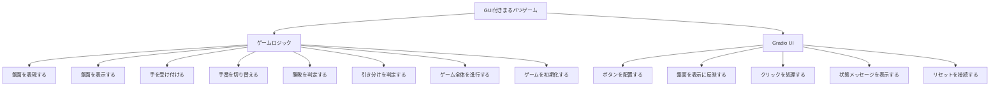

# 講座企画書：Python入門・オンデマンド講座（まるバツゲーム開発で学ぶはじめてのプログラミング）

## 講座概要
本企画は、実際に手元で動く最終成果物（まるバツゲーム）の作成を通して、Python 初学者に自己効力感とそれに起因するPython学習意欲を持たせることを最上位指針とするオンデマンド入門講座である。Google Colab と Gradio を用い、環境構築でつまずかず、初回から動く成果物を体験できる設計とする。

各回では、最終成果物の構成要素となる「モジュール」（例：盤面表示，入力受付，勝敗判定など）を一つずつ作成することを小目標に設定し、その小目標の達成に必要なPythonの文法知識やプログラミング概念を講義する。受講者は、回を重ねるごとに手元でモジュールが積み上がり、最終回には自分の力で動くマルバツゲームが完成するという達成体験を得ることができる。

## 講座の特徴
### ゴール駆動型の設計
本講座最大の特徴は、「最終成果物 → モジュール（小目標） → 必要な文法・概念」というトップダウンの階層構造で講座全体が設計されている点にある。一般的な入門講座では、文法を順番に学んだ後に応用課題に取り組む「ボトムアップ型」の構成が多いが，この方式では受講者が「今なぜこれを学んでいるのか」を見失いやすい。本講座では、常にゴールから逆算して各回の学習内容を定めることで，受講者が学習の目的と現在地を常に把握できるようにしている。

### モジュール積み上げ方式
各回の演習で作成するモジュールは、最終成果物の一部として実際に機能する独立した構成要素である。回を追うごとにモジュールが統合されていくため、受講者は毎回の講座で「自分のゲームが少しずつ完成に近づいている」という手応えを感じることができる。この段階的な達成感が、学習意欲の維持に大きく寄与する。

### 木構造による全体像の可視化
毎回の冒頭で、最終成果物を頂点とする木構造の図を提示し、「全体の中で今回はどの部分を扱うのか」を視覚的に示す。これにより、受講者は個々の学習内容がゲーム全体のどこに位置づけられるかを直感的に理解でき、学習の迷子を防止する。

木構造の図に関しては、mermaid記法で作成する。

## 対象者
プログラミング完全初心者を対象とする。Pythonの環境については、Google Colaboratoryを使用する。

## 最終成果物
gradioを使用したGUI付きまるバツゲーム。

## 各回の進行構成
各回は10分から12分に収めるマイクロラーニングで進めていく。各回の構成・時間内訳は以下の通りに進めていく。

1. 導入（1分）：木構造を用いた全体像の提示。今回作成するモジュールの提示、習得する文法・概念の紹介。
2. 講義前半（6分）：モジュール作成に必要な文法・プログラミング概念の解説（コード例を用いた実演を含む）。
3. 講義後半（2分〜4分）：学んだ知識を活用し、該当モジュールをヒントを与えながら作成してもらう。
4. まとめ（30秒〜1分）：本回の要点整理。次回の予告。全体における現在地の確認。

## 期待される効果
- 目に見える成果物の存在により，受講者の学習意欲が持続する
- モジュール単位の段階的な達成体験により，挫折を防止できる
- ゴール駆動型の構成により，文法学習の目的意識が明確になる
- 最終的に自分で動くアプリケーションを完成させた経験が，その後の学習への自信につながる

## カリキュラム案
本講座は，全10回で最終成果物である「Gradioを使用したGUI付きまるバツゲーム」を完成させる構成とする。講座設計は，最終成果物から必要なモジュールを分解し，そのモジュールを実装するために必要なPython文法・概念を逆算して配置するトップダウン方式で統一する。前半はGoogle Colab上でゲームロジックを段階的に組み立て，後半でGradioによるGUI化を行うことで，完全初心者でも「まず動く」「少しずつ完成する」という達成体験を途切れさせずに学習を進められるようにする。

各回は10分から12分のマイクロラーニングとし，進行構成は以下で統一する。

1. 導入（1分）：木構造を提示し，今回扱うモジュールと学習する文法・概念を確認する。
2. 講義前半（6分）：そのモジュールの作成に必要な文法・概念を，短いコード例とともに解説する。
3. 講義後半（2分〜4分）：ヒントを示しながら，受講者自身に該当モジュールを作成してもらう。
4. まとめ（30秒〜1分）：要点整理，現在地の確認，次回予告を行う。

### 木構造による全体像
毎回の冒頭では，以下の木構造図を提示し，今回扱うノードを強調して現在地を示す。

### 全10回のカリキュラム

#### 第1回：まるバツゲームの盤面を作ろう
- 木構造上の現在地：GUI付きまるバツゲーム > ゲームロジック > 盤面を表現する
- 今回の小目標：3×3の盤面をリストで表現し，Google Colab上で現在の盤面データを確認できるようにする。
- 習得する文法・概念：`print`，変数，文字列，リストの考え方
- 進行構成：
  1. 導入（1分）：最終成果物を示し，「今日はゲームの土台である盤面データを作る」と位置づける。
  2. 講義前半（6分）：盤面を9要素のリストで表す理由を説明し，変数とリスト操作を実演する。
  3. 講義後半（3分）：空の盤面を表すリストを受講者自身に作成してもらう。
  4. まとめ（1分）：盤面は以後すべてのモジュールの土台になることを確認する。
- この回終了時点でできること：盤面をデータとして保持し，セル番号と中身の対応を理解できる。

#### 第2回：盤面を見やすく表示しよう
- 木構造上の現在地：GUI付きまるバツゲーム > ゲームロジック > 盤面を表示する
- 今回の小目標：盤面データを受け取り，3行3列で見やすく表示する関数を作る。
- 習得する文法・概念：関数定義，関数呼び出し，引数，戻り値を使わない関数，文字列の連結，改行
- 進行構成：
  1. 導入（1分）：木構造上で「盤面を表現する」から「盤面を表示する」へ進むことを示す。
  2. 講義前半（6分）：関数の役割を説明し，盤面表示専用の関数を段階的に組み立てる。
  3. 講義後半（3分）：与えられた盤面を3行3列で表示する関数を実装してもらう。
  4. まとめ（1分）：データと表示を分けることで，後の修正がしやすくなることを確認する。
- この回終了時点でできること：盤面データを人が読める形で表示できる。

#### 第3回：プレイヤーの手を受け付けよう
- 木構造上の現在地：GUI付きまるバツゲーム > ゲームロジック > 手を受け付ける
- 今回の小目標：どのマスに印を置くかを受け取り，不正な入力や使用済みマスを弾けるようにする。
- 習得する文法・概念：`input` の考え方，条件分岐，比較演算子，`if`，`elif`，`else`
- 進行構成：
  1. 導入（1分）：ゲームが動くためには「どこに置くか」を判断する必要があると説明する。
  2. 講義前半（6分）：空いているマスかどうかを条件分岐で判定する流れを実演する。
  3. 講義後半（3分）：指定した位置に置けるかどうかを判定するコードを作成してもらう。
  4. まとめ（1分）：プログラムは入力をそのまま信用せず，条件で安全を確保することを確認する。
- この回終了時点でできること：有効な手だけを受け付ける土台ができる。

#### 第4回：手番を切り替えながら1手ずつ進めよう
- 木構造上の現在地：GUI付きまるバツゲーム > ゲームロジック > 手番を切り替える
- 今回の小目標：現在のプレイヤーを管理し，1手打つたびに `X` と `O` を交互に切り替えられるようにする。
- 習得する文法・概念：代入，再代入，状態管理，条件式を使った切り替え
- 進行構成：
  1. 導入（1分）：ゲームらしさを生む要素として「交互に打つ」仕組みを位置づける。
  2. 講義前半（6分）：現在の手番を表す変数を用意し，1手後に別の値へ切り替える流れを説明する。
  3. 講義後半（3分）：盤面更新と手番切り替えを連続で行う処理を書いてもらう。
  4. まとめ（1分）：状態を1つずつ更新することがゲーム制御の基本であると整理する。
- この回終了時点でできること：2人が交互に手を打てる簡易版ゲームになる。

#### 第5回：勝ったかどうかを判定しよう
- 木構造上の現在地：GUI付きまるバツゲーム > ゲームロジック > 勝敗を判定する
- 今回の小目標：横・縦・斜めの並びを調べ，勝者がいるかを判定する関数を作る。
- 習得する文法・概念：複数条件の比較，論理演算，タプルやリストによる組み合わせ管理，繰り返しの基本的な考え方
- 進行構成：
  1. 導入（1分）：ゲームの核である「勝ち」を判定できるようにする回であると示す。
  2. 講義前半（6分）：8通りの勝利パターンを一覧化し，順番に調べる考え方を説明する。
  3. 講義後半（3分）：勝者がいれば `X` または `O` を返す関数を作成してもらう。
  4. まとめ（1分）：複雑な条件も，組み合わせを整理すれば扱えることを確認する。
- この回終了時点でできること：勝敗が決まった瞬間をプログラムが判断できる。

#### 第6回：引き分けとゲーム終了を判定しよう
- 木構造上の現在地：GUI付きまるバツゲーム > ゲームロジック > 引き分けを判定する
- 今回の小目標：勝者がいないまま盤面が埋まった場合を引き分けとして扱い，ゲーム終了条件を完成させる。
- 習得する文法・概念：複数条件の整理，否定条件，リストに空きが残っているかの判定，`None` のような「まだ決まっていない状態」の扱い
- 進行構成：
  1. 導入（1分）：ゲームには「勝ち」だけでなく「引き分け」も必要であることを示す。
  2. 講義前半（6分）：勝者判定と引き分け判定の順序，ゲーム終了条件の組み立て方を解説する。
  3. 講義後半（3分）：勝ち・引き分け・継続中を区別して返す判定処理を書いてもらう。
  4. まとめ（1分）：条件を順序立てて考えることで，分岐の混乱を防げると確認する。
- この回終了時点でできること：ゲームがいつ終了するかを正しく判定できる。

#### 第7回：ゲーム全体を動かす処理をまとめよう
- 木構造上の現在地：GUI付きまるバツゲーム > ゲームロジック > ゲーム全体を進行する
- 今回の小目標：盤面表示，入力受付，手番切り替え，勝敗判定をつなぎ，CUI版のまるバツゲームを完成させる。
- 習得する文法・概念：関数同士の連携，処理の順序設計，繰り返し処理の基本，段階的なデバッグ
- 進行構成：
  1. 導入（1分）：これまで作ったモジュールを統合して，一度ゲーム全体を完成させる回だと示す。
  2. 講義前半（6分）：1ターンの流れを整理し，どの順で関数を呼ぶべきかを図解する。
  3. 講義後半（3分）：ゲームが開始から終了まで動く処理を組み立ててもらう。
  4. まとめ（1分）：小さなモジュールを組み合わせることで大きなプログラムが作れると振り返る。
- この回終了時点でできること：Google Colab上で遊べるCUI版まるバツゲームが完成する。

#### 第8回：もう一度遊べるように初期化しよう
- 木構造上の現在地：GUI付きまるバツゲーム > ゲームロジック > ゲームを初期化する
- 今回の小目標：盤面と手番を初期状態に戻し，再プレイできるリセット処理を作る。
- 習得する文法・概念：初期値，関数による状態の再設定，処理の切り出し，再利用
- 進行構成：
  1. 導入（1分）：完成したゲームを「1回遊んで終わり」にしないための仕上げであると説明する。
  2. 講義前半（6分）：初期状態をどこで定義し，どの関数で戻すと保守しやすいかを解説する。
  3. 講義後半（3分）：リセット関数を作成し，複数回遊べるようにしてもらう。
  4. まとめ（1分）：初期化処理も独立したモジュールとして設計すると再利用しやすいと整理する。
- この回終了時点でできること：ロジック面が完成し，何度でも遊べる状態になる。

#### 第9回：Gradioで画面を作ろう
- 木構造上の現在地：GUI付きまるバツゲーム > Gradio UI > ボタンを配置する / 状態メッセージを表示する
- 今回の小目標：Colab上でGradioを使い，9つのボタンとステータス表示を持つ画面を作る。
- 習得する文法・概念：ライブラリ利用の基本，`import`，コンポーネント，GUIとデータの対応付け
- 進行構成：
  1. 導入（1分）：ここからは「作ったロジックに見た目を与える段階」であると位置づける。
  2. 講義前半（6分）：Gradioの基本構成を説明し，ボタンとテキスト表示の配置を実演する。
  3. 講義後半（3分）：9マスのボタンと状態表示欄を受講者自身に配置してもらう。
  4. まとめ（1分）：GUIは新しい仕組みではなく，既存ロジックの見せ方を変える層であると確認する。
- この回終了時点でできること：ゲームの見た目となる画面の骨組みが完成する。

#### 第10回：GUIとゲームロジックをつないで完成させよう
- 木構造上の現在地：GUI付きまるバツゲーム > Gradio UI > クリックを処理する / 盤面を表示に反映する / リセットを接続する
- 今回の小目標：クリック時に盤面を更新し，勝敗結果と手番表示を反映し，リセットボタンまで含めた完成版を作る。
- 習得する文法・概念：イベント処理，関数とUIの接続，状態の受け渡し，完成版コードの読み解き方
- 進行構成：
  1. 導入（1分）：木構造の最終ノードを確認し，「今日で完成する」ことを明示する。
  2. 講義前半（6分）：ボタンクリック時にどの関数が呼ばれ，どの値が画面に返るかを流れで説明する。
  3. 講義後半（3分）：クリック処理とリセット処理を接続し，完成版を仕上げてもらう。
  4. まとめ（1分）：完成版の達成を振り返り，文字変更，AI対戦化，デザイン変更などの発展課題を紹介する。
- この回終了時点でできること：Gradioを使用したGUI付きまるバツゲームが完成する。

### カリキュラム設計上の補足
本カリキュラムでは，毎回の小目標が最終成果物の構成要素として実際に機能するように設計している。そのため，文法学習が単独で切り出されることはなく，「今この文法を学ぶ理由」が常にモジュールの完成と直結する。第1回から第8回まではゲームロジックを積み上げ，第9回と第10回でGradioによるGUI化を行うことで，受講者は「まず動く」「次に見た目が整う」という二段階の達成体験を得られる。

また，各回の冒頭で木構造図を用いて現在地を示すことで，受講者は自分が最終成果物のどの部分を作っているのかを常に把握できる。これにより，完全初心者が陥りやすい「文法は学んでいるが，何のために学んでいるのかわからない」という状態を防ぎ，自己効力感と継続意欲を高めることを狙う。
